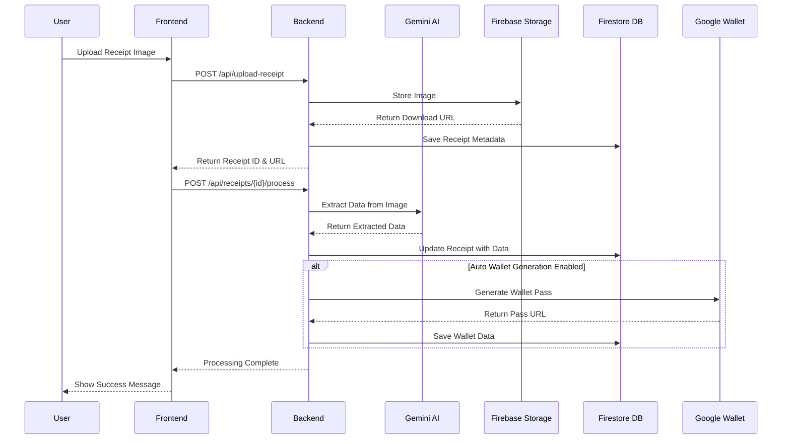
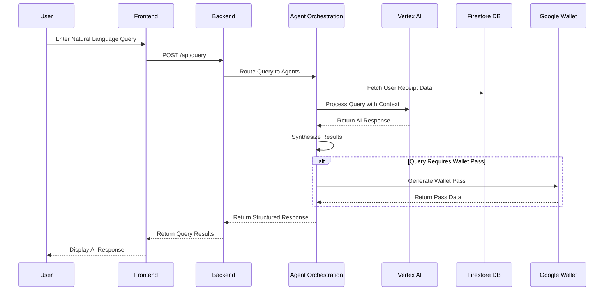
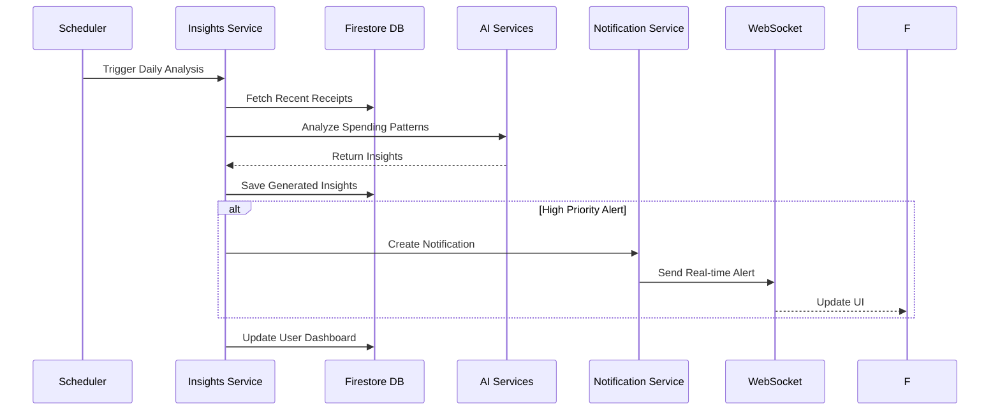
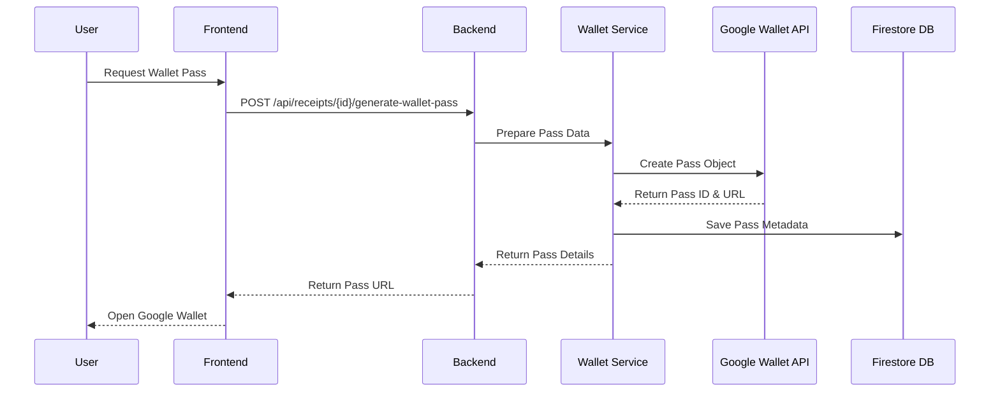

# 🏗️ Project Raseed - System Architecture & Flow Diagram

## 🎯 Technology Stack Overview

```
┌─────────────────────────────────────────────────────────────────────────────┐
│                           PROJECT RASEED ARCHITECTURE                        │
├─────────────────────────────────────────────────────────────────────────────┤
│                                                                             │
│  ┌─────────────────┐    ┌─────────────────┐    ┌─────────────────────────┐  │
│  │   FRONTEND      │    │    BACKEND      │    │   EXTERNAL SERVICES     │  │
│  │   (React.js)    │◄──►│   (FastAPI)     │◄──►│   (Google Cloud)       │  │
│  └─────────────────┘    └─────────────────┘    └─────────────────────────┘  │
│           │                       │                       │                  │
│           ▼                       ▼                       ▼                  │
│  ┌─────────────────┐    ┌─────────────────┐    ┌─────────────────────────┐  │
│  │   UI Components │    │   API Services  │    │   AI/ML Services        │  │
│  │   - Upload      │    │   - Receipt     │    │   - Gemini Vision       │  │
│  │   - Receipts    │    │   - Insights    │    │   - Document AI         │  │
│  │   - Query       │    │   - Wallet      │    │   - Vertex AI           │  │
│  │   - Insights    │    │   - Notifications│   │   - Google Wallet       │  │
│  └─────────────────┘    └─────────────────┘    └─────────────────────────┘  │
│           │                       │                       │                  │
│           ▼                       ▼                       ▼                  │
│  ┌─────────────────┐    ┌─────────────────┐    ┌─────────────────────────┐  │
│  │   State Mgmt    │    │   Data Layer    │    │   Storage Services      │  │
│  │   - Context API │    │   - Firebase    │    │   - Firebase Storage    │  │
│  │   - Reducers    │    │   - Firestore   │    │   - Firestore DB        │  │
│  │   - Hooks       │    │   - WebSockets  │    │   - Real-time Updates   │  │
│  └─────────────────┘    └─────────────────┘    └─────────────────────────┘  │
│                                                                             │
└─────────────────────────────────────────────────────────────────────────────┘
```

## 🔄 Complete System Flow Diagram

```mermaid
graph TB
    %% User Interface Layer
    subgraph "👤 User Interface (React.js)"
        UI[User Interface]
        Upload[Upload Page]
        Receipts[Receipts Page]
        Query[Query Page]
        Insights[Insights Page]
        Wallet[Wallet Integration]
    end

    %% Frontend Services
    subgraph "🔧 Frontend Services"
        ApiService[API Service]
        ReceiptService[Receipt Service]
        InsightsService[Insights Service]
        WalletService[Wallet Service]
        Context[React Context]
    end

    %% Backend API Layer
    subgraph "🚀 Backend API (FastAPI)"
        FastAPI[FastAPI Server]
        CORS[CORS Middleware]
        Routes[API Routes]
        WebSocket[WebSocket Manager]
    end

    %% Backend Services
    subgraph "⚙️ Backend Services"
        ReceiptAPI[Receipt Service]
        AIAPI[AI Service]
        WalletAPI[Wallet Service]
        InsightsAPI[Insights Service]
        NotificationAPI[Notification Service]
        DocumentAI[Document AI Service]
        AgentOrchestration[Agent Orchestration]
    end

    %% AI/ML Services
    subgraph "🤖 AI/ML Services (Google Cloud)"
        Gemini[Gemini Vision AI]
        DocumentAI_GC[Google Document AI]
        VertexAI[Vertex AI]
        LanguageModel[Natural Language Processing]
    end

    %% Storage Layer
    subgraph "💾 Storage (Firebase)"
        FirebaseStorage[Firebase Storage]
        Firestore[Firestore Database]
        RealTime[Real-time Updates]
    end

    %% External Services
    subgraph "🌐 External Services"
        GoogleWallet[Google Wallet API]
        PushNotifications[Push Notifications]
        EmailService[Email Service]
    end

    %% Flow Connections
    UI --> Upload
    UI --> Receipts
    UI --> Query
    UI --> Insights
    UI --> Wallet

    Upload --> ApiService
    Receipts --> ApiService
    Query --> ApiService
    Insights --> ApiService
    Wallet --> ApiService

    ApiService --> FastAPI
    FastAPI --> CORS
    CORS --> Routes
    Routes --> WebSocket

    Routes --> ReceiptAPI
    Routes --> AIAPI
    Routes --> WalletAPI
    Routes --> InsightsAPI
    Routes --> NotificationAPI
    Routes --> DocumentAI
    Routes --> AgentOrchestration

    %% AI Processing Flow
    ReceiptAPI --> AIAPI
    AIAPI --> Gemini
    AIAPI --> DocumentAI_GC
    DocumentAI --> DocumentAI_GC

    %% Query Processing Flow
    AgentOrchestration --> VertexAI
    AgentOrchestration --> LanguageModel

    %% Storage Flow
    ReceiptAPI --> FirebaseStorage
    ReceiptAPI --> Firestore
    InsightsAPI --> Firestore
    NotificationAPI --> Firestore

    %% Wallet Flow
    WalletAPI --> GoogleWallet
    WalletAPI --> FirebaseStorage

    %% Real-time Updates
    WebSocket --> RealTime
    RealTime --> Context
    Context --> UI

    %% Notifications
    NotificationAPI --> PushNotifications
    NotificationAPI --> EmailService

    %% Styling
    classDef frontend fill:#e1f5fe
    classDef backend fill:#f3e5f5
    classDef ai fill:#e8f5e8
    classDef storage fill:#fff3e0
    classDef external fill:#fce4ec

    class UI,Upload,Receipts,Query,Insights,Wallet,ApiService,ReceiptService,InsightsService,WalletService,Context frontend
    class FastAPI,CORS,Routes,WebSocket,ReceiptAPI,AIAPI,WalletAPI,InsightsAPI,NotificationAPI,DocumentAI,AgentOrchestration backend
    class Gemini,DocumentAI_GC,VertexAI,LanguageModel ai
    class FirebaseStorage,Firestore,RealTime storage
    class GoogleWallet,PushNotifications,EmailService external
```



## 📊 Detailed Data Flow

### 1. 📤 Receipt Upload Flow



### 2. 🔍 Natural Language Query Flow



### 3. 📊 Insights Generation Flow



### 4. 💳 Wallet Pass Generation Flow



## 🏗️ Component Architecture

### Frontend Components
```
src/
├── components/
│   ├── Layout/
│   │   ├── Header.js
│   │   ├── Sidebar.js
│   │   └── Navigation.js
│   ├── Receipt/
│   │   ├── ReceiptCard.js
│   │   ├── ReceiptList.js
│   │   └── WalletButton.js
│   ├── Upload/
│   │   ├── UploadArea.js
│   │   └── FilePreview.js
│   ├── Query/
│   │   ├── QueryInterface.js
│   │   └── MessageList.js
│   └── Insights/
│       ├── InsightsList.js
│       └── NotificationsCenter.js
├── pages/
│   ├── UploadPage.js
│   ├── ReceiptsPage.js
│   ├── QueryPage.js
│   └── InsightsPage.js
├── services/
│   ├── api.js
│   ├── receiptService.js
│   ├── insightsService.js
│   └── walletService.js
└── context/
    ├── ReceiptContext.js
    └── AuthContext.js
```

### Backend Services
```
app/
├── api/
│   ├── routes.py (Receipt endpoints)
│   ├── insights_routes.py (Insights endpoints)
│   └── websocket_routes.py (Real-time updates)
├── services/
│   ├── receipt_service.py (Receipt management)
│   ├── ai_service.py (Gemini Vision integration)
│   ├── document_ai_service.py (Document AI processing)
│   ├── wallet_service.py (Google Wallet integration)
│   ├── insights_service.py (Spending analysis)
│   ├── notification_service.py (Real-time notifications)
│   ├── agent_orchestration_service.py (Multi-agent system)
│   ├── vertex_ai_agent_service.py (Vertex AI integration)
│   └── query_service.py (Natural language queries)
├── models/
│   ├── receipt.py (Data models)
│   └── user.py (User models)
└── core/
    ├── config.py (Configuration)
    ├── database.py (Firebase setup)
    └── logging.py (Logging setup)
```

## 🔧 Technology Stack Details

### Frontend Technologies
- **React.js 18+** - UI Framework
- **React Context API** - State Management
- **React Router** - Navigation
- **Axios** - HTTP Client
- **Lucide React** - Icons
- **CSS3** - Styling with responsive design

### Backend Technologies
- **FastAPI** - Web Framework
- **Pydantic** - Data Validation
- **Uvicorn** - ASGI Server
- **WebSockets** - Real-time Communication
- **Python 3.8+** - Programming Language

### AI/ML Services
- **Google Gemini Vision AI** - Image processing and data extraction
- **Google Document AI** - Specialized receipt processing
- **Google Vertex AI** - Natural language understanding
- **Google Cloud Platform** - Infrastructure

### Storage & Database
- **Firebase Storage** - File storage for receipt images
- **Firestore Database** - NoSQL database for metadata
- **Firebase Authentication** - User management

### External Integrations
- **Google Wallet API** - Digital pass generation
- **Google Cloud Functions** - Serverless processing
- **Push Notifications** - Real-time alerts

## 🚀 Deployment Architecture

```
┌─────────────────────────────────────────────────────────────────────────────┐
│                           PRODUCTION DEPLOYMENT                             │
├─────────────────────────────────────────────────────────────────────────────┤
│                                                                             │
│  ┌─────────────────┐    ┌─────────────────┐    ┌─────────────────────────┐  │
│  │   CDN/Static    │    │   Load Balancer │    │   Google Cloud Run      │  │
│  │   (Frontend)    │◄──►│   (Cloud Load   │◄──►│   (Backend API)        │  │
│  │                 │    │   Balancer)     │    │                         │  │
│  └─────────────────┘    └─────────────────┘    └─────────────────────────┘  │
│           │                       │                       │                  │
│           ▼                       ▼                       ▼                  │
│  ┌─────────────────┐    ┌─────────────────┐    ┌─────────────────────────┐  │
│  │   Firebase      │    │   Cloud SQL     │    │   Cloud Functions       │  │
│  │   Hosting       │    │   (Optional)    │    │   (Background Tasks)    │  │
│  └─────────────────┘    └─────────────────┘    └─────────────────────────┘  │
│           │                       │                       │                  │
│           ▼                       ▼                       ▼                  │
│  ┌─────────────────┐    ┌─────────────────┐    ┌─────────────────────────┐  │
│  │   Firebase      │    │   Cloud Storage │    │   Cloud Pub/Sub         │  │
│  │   Firestore     │    │   (Backup)      │    │   (Event Processing)    │  │
│  └─────────────────┘    └─────────────────┘    └─────────────────────────┘  │
│                                                                             │
└─────────────────────────────────────────────────────────────────────────────┘
```

## 📈 Performance & Scalability

### Performance Metrics
- **Image Processing**: < 5 seconds per receipt
- **Query Response**: < 2 seconds for natural language queries
- **Real-time Updates**: < 100ms latency
- **Concurrent Users**: 1000+ simultaneous users

### Scalability Features
- **Horizontal Scaling**: Auto-scaling backend services
- **Caching**: Redis for frequently accessed data
- **CDN**: Global content delivery for static assets
- **Database**: Firestore auto-scaling
- **Queue System**: Background task processing

### Security Measures
- **Authentication**: Firebase Auth integration
- **Authorization**: Role-based access control
- **Data Encryption**: TLS 1.3 for data in transit
- **API Security**: Rate limiting and CORS protection
- **Input Validation**: Pydantic models for data validation

This comprehensive architecture ensures Project Raseed can handle real-world usage while maintaining high performance, security, and scalability. 